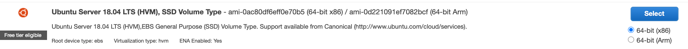
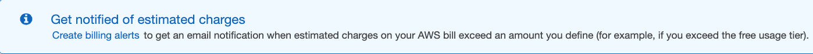
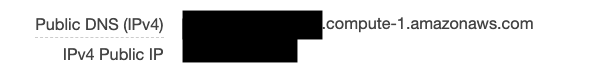

# Deploy a node server on EC2

1. Launch your EC2 instance on AWS
    * Sign in to your AWS count (preferably not root)
    * go to the EC2 dashboard via services and launch instance
   
    
    * choose new Ubuntu Server free tier

    
    * continue through options choosing all defaults until it asks about creating a key pair
    * either create one and save it in a secure location or choose a pre-existing .pem
    * I would suggest creating a billing alert so you can manage when you will be charged

    
    * go view your instances and take note of the Public DNS and Public IP in the description menu

    

2. cd into folder where you saved your .pem file using your terminal
3. change the permissions of the .pem file
    ```
    chmod 600 ./<NAME OF FILE>.pem
    ```